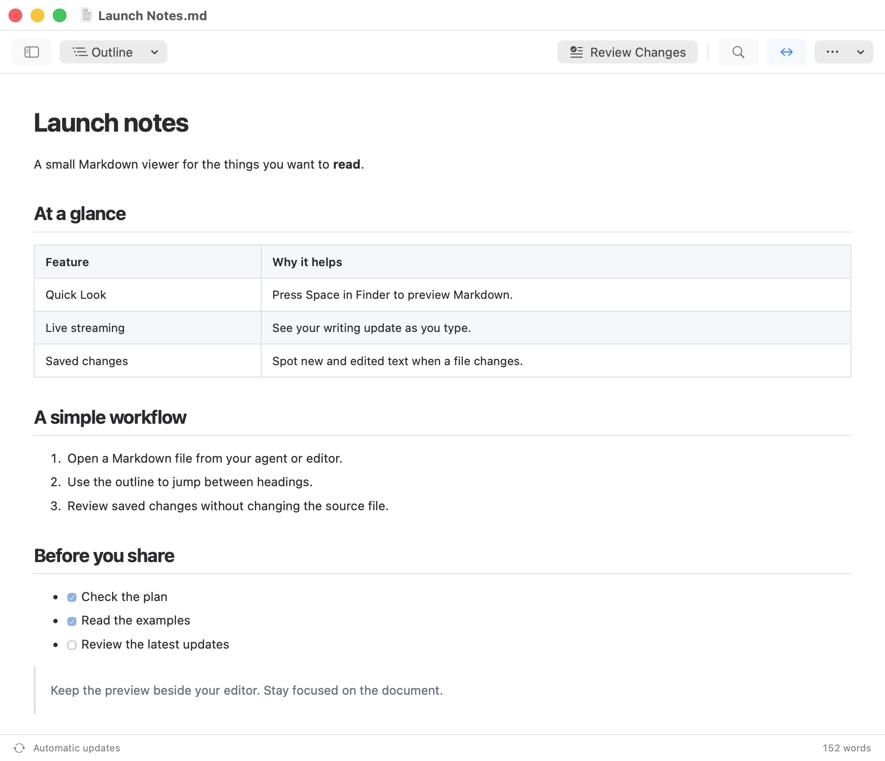
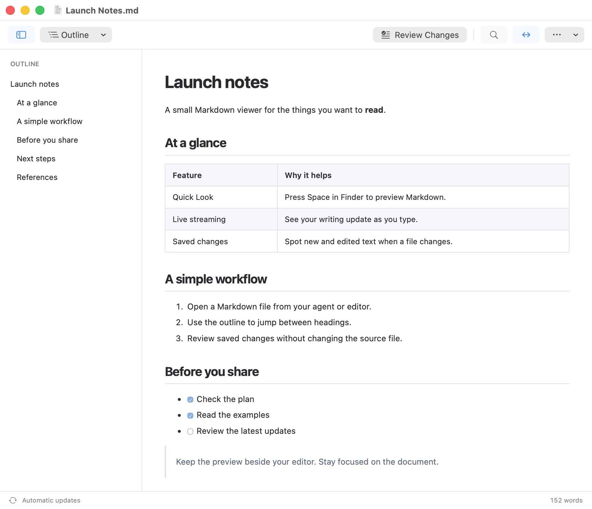
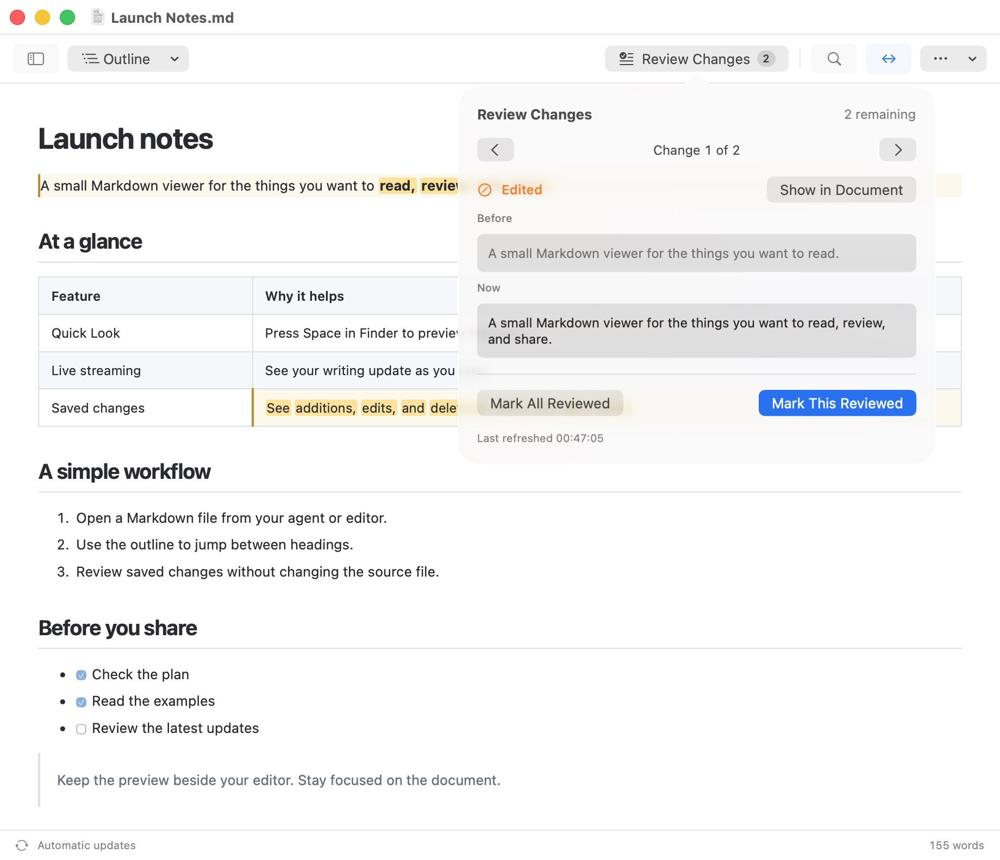
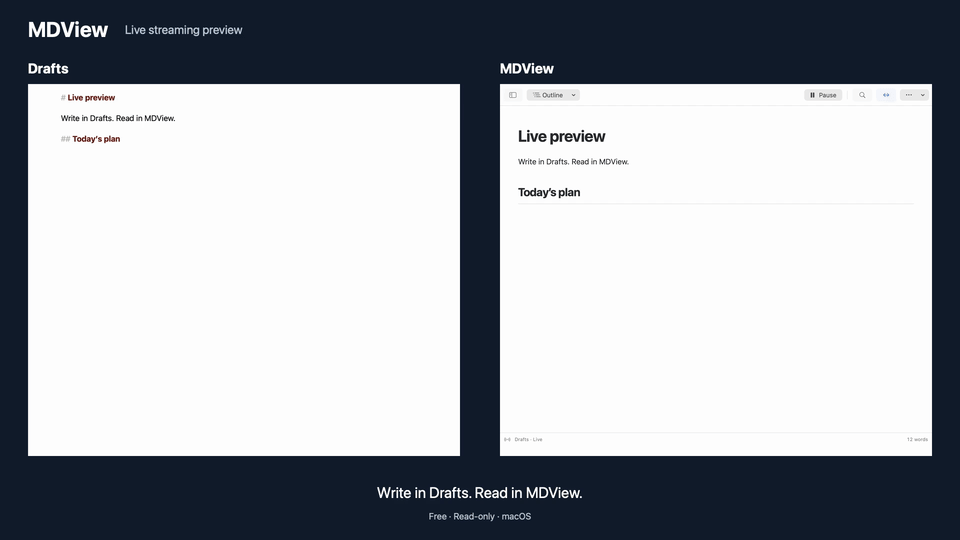

# MDView

A small, read-only Markdown viewer for macOS 14 and later. Open files written by your agents, or preview a draft from Drafts.

- Native document windows, Open Recent, and multiple files.
- Automatic refresh, including editors that replace files atomically.
- Tables, task lists, links, code blocks, footnotes, and blockquotes.
- Sidebar and top-bar outline navigation, find, zoom, light/dark appearance, and a direct full-width toggle.
- Highlights for saved changes, with previous text, deletions, next/previous navigation, and individual or whole-document acknowledgement.
- A bundled modern Finder Quick Look preview extension.
- A Drafts URL action that sends previews without creating temporary files.
- Live streaming (new in 1.1) through the public Marked-compatible channel; Drafts is the tested integration.

## Install and use

Download the DMG from the [latest release](https://github.com/HighGainDesign/MDView/releases/latest),
open it, and drag **MDView.app** onto **Applications**. Eject the installer before
launching the installed copy. Updates use the same process; quit MDView before
replacing it. MDView supports Apple Silicon and Intel Macs running macOS 14 or later.

Open a Markdown file through Finder's **Open With → MDView**, or use **File → Open**.
The setup guide explains the optional Quick Look extension and Drafts action;
both are also available in Settings. You can return to the guide at any time.

MDView 1.x targets macOS. A possible version 2.0 may add iOS while retaining
the shared parser and rendering code.

## See it in action

### A simple Markdown reader

Open documents from your editor or coding agent. Tables, lists, links, and code
blocks render in a native, read-only window. Update status and word count stay
in the footer; reading controls stay in the toolbar.



### Find your place with the outline

Use the sidebar for a persistent document outline, or the **Outline** dropdown
for a quick jump to a heading.



### See what changed

Saved files refresh automatically. Added and edited text is highlighted, and
**Review Changes** shows previous text, deletions, and navigation between changes.
**Mark This Reviewed** clears one highlight and advances to the next change;
**Mark All Reviewed** acknowledges the remaining changes. Neither modifies the file.



### Live streaming

**New in 1.1.**

Keep MDView beside Drafts and see headings, lists, and tables update as you write.
**Pause** holds the current preview; **Resume** catches up to the latest text.
There is no export step and no temporary Markdown file to manage.



[Watch or download the 25-second MP4 demo](Assets/Media/live-streaming.mp4).
Recorded from the real Drafts and MDView windows with a disposable sample;
idle time is trimmed, and the pointer is hidden.
See [live streaming setup and compatibility](#live-streaming-and-drafts) below.

## Build and run

Install Xcode 26+ and [XcodeGen](https://github.com/yonaskolb/XcodeGen), then run:

```sh
./script/build_and_run.sh
```

The script regenerates the Xcode project, builds both targets, and launches MDView. It supports `--verify`, `--debug`, `--logs`, and `--telemetry`. Build products default to `/tmp/MDView-build-<uid>` so Dropbox metadata does not interfere with code signing. Override with `MDVIEW_BUILD_DIR`. It uses an existing Developer ID Application or Apple Development certificate if available; set `MDVIEW_SIGNING_IDENTITY` to override.

To run tests after generating the project:

```sh
xcodebuild -project MDView.xcodeproj -scheme MDView \
  -destination 'platform=macOS' -derivedDataPath /tmp/MDView-tests \
  CODE_SIGN_IDENTITY=- test
```

Open a Markdown file with Finder’s **Open With → MDView**, File → Open, or:

```sh
open -a /tmp/MDView-build-$(id -u)/Build/Products/Debug/MDView.app path/to/note.md
```

For everyday use, copy the verified signed app to `/Applications` and launch that copy. The build/run script creates development builds in the temporary folder and does not automatically replace an installed copy.

## Quick Look

The preview extension is embedded in MDView and is installed with the app; no separate installer is needed. Launch the app once. Settings includes **Open Extension Settings…** and a setup guide with an optional **Don’t show again** checkbox. Opening System Settings or importing the Drafts action leaves the guide open; only **Done** or closing the guide saves that choice. Then select a `.md` file in Finder and press Space. You can enable or disable **MDView Quick Look** in **System Settings → General → Login Items & Extensions → By Category → Quick Look** (or search System Settings for Quick Look). macOS may choose another enabled Markdown preview extension; disable competing Markdown extensions if you want MDView’s preview. Disabling MDView’s extension does not affect the app or Drafts action.

Without an Apple signing certificate, the script falls back to ad-hoc signing for app development; Finder Quick Look may require a real Apple signature. Distribution requires signing the app and extension with your own Apple team and notarizing or submitting them. Moving a signed build into Applications provides a stable location for extension registration.

Appearance sharing uses a macOS App Group authorized by the signing team's ID.
An ad-hoc build cannot verify that identity. Automated tests use isolated
preferences; signed app/extension integration must be tested separately. For
your own signed builds, see [Contributing](CONTRIBUTING.md) for team configuration.

## Reading width and saved changes

Settings offers **System**, **Light**, and **Dark** document appearance. This preference updates all open document windows immediately and applies to new Finder Quick Look previews, even when MDView is closed. Close and reopen an existing Quick Look preview to see a changed preference. Your previous appearance choice is preserved on the first launch after updating.

Documents open at full width by default. Comfortable width caps long paragraphs. The **↔ width button** in the top bar switches the current window to full width; Settings chooses the default for newly opened documents. Tables fill the available reading width and wrap at word boundaries, with horizontal scrolling when necessary.

File-backed documents refresh automatically, including atomic saves. MDView compares their rendered contents with the version you last reviewed. Added blocks use green highlights; edited blocks use amber with changed words marked. The top-bar changes button shows previous text and deletions and can jump to a change. **Mark This Reviewed** acknowledges one change and advances to the next, including deletions. **Mark All Reviewed** clears all remaining highlights. Acknowledgement advances an in-memory comparison baseline; if reviewed text changes again, it returns for review against the text you acknowledged. The baseline is held for the current document session, and changes accumulate across saves until reviewed. Drafts URL previews are snapshots; live streaming follows the editor separately.

For very large documents, review falls back to comparison by section position and labels that limitation in the panel.

## Create a signed installer

The release script builds universal Apple Silicon/Intel binaries, verifies app/extension signing and debugger entitlements, notarizes and staples the app, creates a DMG with an Applications symlink, and notarizes and staples the DMG. The Drafts action lives inside the app and can be installed from Settings.

```sh
python3 -m venv /tmp/mdview-dmg-env
/tmp/mdview-dmg-env/bin/pip install ds_store==1.3.2
MDVIEW_DMG_PYTHON=/tmp/mdview-dmg-env/bin/python ./script/release.sh
```

Set `MDVIEW_SIGNING_IDENTITY`, `MDVIEW_TEAM_ID`, and `MDVIEW_NOTARY_PROFILE` for your signing setup. The default profile is `Notarize`. `--build-only` produces the signed app; `--skip-notarize` creates a signed local DMG without submitting to Apple. The script never publishes to GitHub. After packaging, it preserves the signed app as a ZIP in the release build folder and removes temporary app/staging copies so macOS cannot rediscover them in Open With or Extensions. Use `--build-only` to keep a build app, or `MDVIEW_KEEP_BUILD_APP=1` temporarily for native QA.

The icon uses the public-domain [Markdown Mark](https://github.com/dcurtis/markdown-mark) with a loupe over its enlarged arrow. `App/AppIcon.icon` is the editable four-layer Icon Composer document for macOS and future iOS use. Glass translucency is 35%; the rim has specular lighting, and the arrow stays crisp. Xcode compiles its appearance variants and legacy fallback icon. The flat vector reference and geometry metadata are in `Assets/IconDesign/`.

## Live streaming and Drafts

See [the Drafts action setup](Integrations/Drafts/README.md). URL preview:

```text
mdview://preview?text=URL_ENCODED_MARKDOWN&title=URL_ENCODED_TITLE
```

For live typing previews, enable **Marked streaming preview** in **Drafts Settings
→ General**, then choose **File → Live Streaming Preview** in MDView (also available
in Settings and the welcome window). Drafts may require Marked to be installed
to enable its stream, but Marked can stay closed. No Marked upgrade is needed.
MDView independently implements the publicly documented
[Marked streaming protocol](https://markedapp.com/help/Streaming_Preview), created
by Brett Terpstra, using its `mkStreamingPreview` channel. MDView is not affiliated
with or endorsed by Marked. It reads that named channel only while the live
window is open and unpaused; it never reads or writes your ordinary clipboard. **Pause** keeps the
current preview, and **Resume** catches up to the latest streamed text. Other
editors using the same channel are accepted too; their compatibility has not
been manually verified. The footer displays the editor’s optional source
metadata, or “Live stream” when none is supplied.

An optional Drafts URL action can open this window with `mdview://stream`.
Opening it again reuses the live window. Live streams do not create files or
change drafts. Unlike saved-file change review, they show the current text
without accumulating highlights across different drafts. The channel does not
identify drafts by UUID, so it cannot pin a preview to a particular draft.
Relative images have no document folder to resolve against; remote images
retain the usual per-window opt-in.

## Rendering and iOS

[Apex](https://github.com/ApexMarkdown/apex) 1.1.34 performs Markdown parsing through its native C library. [SwiftSoup](https://github.com/scinfu/SwiftSoup) 2.13.9 prepares the generated HTML for display, and WebKit displays it. The versions are pinned in `project.yml`. App and Quick Look compile the same `Shared` sources and CSS. Those sources have no AppKit dependency and can serve a future iOS document reader; platform document/open/share handling remains separate.

There is no runtime CDN, external parser process, or bundled JavaScript parser. Parsing runs outside the main actor.

## Current boundaries

- Markdown is never edited or saved by MDView.
- UTF-8 and BOM-marked UTF-16 files are supported, up to 8 MB.
- Raw HTML is omitted. Scripts, plugins, file includes, syntax-highlighting tools, and math rendering are disabled.
- Callout markers such as `[!NOTE]` remain readable inside ordinary blockquotes; specialized callout styling is deferred.
- Images linked to websites are off by default. In the current document’s **Reading options (…) → Load Remote Images**, you can opt in to HTTPS images. Hosts can see your IP address and image requests; MDView sends no document referrer. This choice lasts only until you close the document, and Quick Look never loads remote images. PNG, JPEG, GIF, and WebP images in the document’s folder load automatically when macOS permits access. If folder permission is needed, use **Grant Image Folder…**; MDView retains read-only access to the chosen folder. Relative paths and symlinks must stay within the document folder or an explicitly granted image folder. Quick Look previews text and embedded data images.
- Links open in the browser/mail app; relative file links open as another document subject to macOS file permissions.
- Code blocks use monospace styling; syntax coloring, PDF export, and an iOS app are future work.

## Licenses

MDView is released under the [MIT license](LICENSE). Contributions and bug reports
are welcome; see [Contributing](CONTRIBUTING.md) and the [changelog](CHANGELOG.md).
For vulnerability reports, see [Security](SECURITY.md).

Apex, its cmark-gfm/libyaml dependencies, and SwiftSoup are MIT licensed. Their license texts are bundled with the reader.
The Markdown Mark is public domain; its notice is also bundled.
